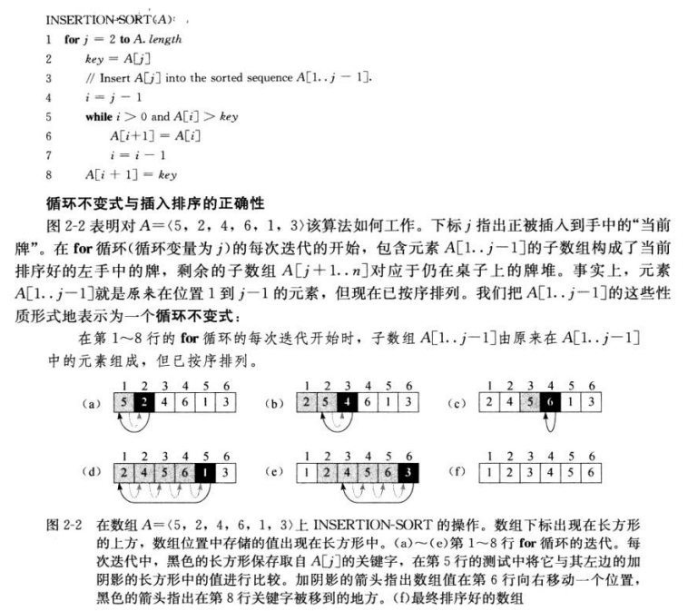

# Introduction
 排序算法总结以及代码详解（Python & C/C++）
  
 
# Codes of Python & C/C++
<table>
<tr>
<td>Sorting Algorithm/排序算法</td>
<td>Average Time Complexity/平均时间复杂度</td>
<td>Python</td>
<td>C/C++</td>
</tr>
<tr>
<td>Insertion Sort/冒泡排序</td>
<td>O(n^2)</td>
<td><a href="insertion_sort/insertion_sort.py">insertion_sort.py</a></td>
<td>insertion_sort.cpp</td>
</tr>
<tr>
<td>Select Sort/选择排序</td>
<td>O(n^2)</td>
<td><a href="select_sort/select_sort.py">select_sort.py</a></td>
<td>select_sort.cpp</td>
</tr>
</table>

# 算法原理
<h2>插入排序</h2>

动画演示：

<h2>选择排序</h2>
动画演示：

<h2>归并排序</h2>
动画演示：

